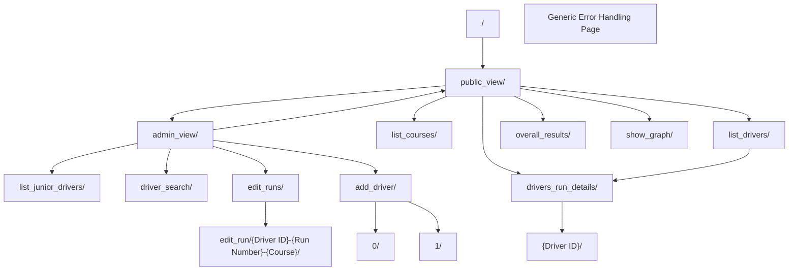

# COMP636_BRMM_Web_App - Report
Shun Lyu 1158154
A small Web Application to help the manage drivers, cars, courses and runs for a single competitive Motorkhana event.


# Web application structure:

## Routes
- /: Root
  - admin_view/: Admin interface
    - list_junior_drivers/: List of junior driver
    - driver_search/: Can search and display result
    - edit_runs/: Edit run based on the selection
      - edit_run/{Driver ID}-{Run Number}-{Course}/: Url is structured with three keyword
    - add_driver/: Add new driver
      - 0/: For caregiver driver
      - 1/: For junior driver
  - public_view/: public interface
    - list_courses/: List courses with GIF
    - drivers_run_details/: List driver's detail
      - {Driver ID}/: Url contains the driver's ID
    - list_drivers/: List of driver with link jump to above
    - overall_results/: Shows the overall results
    - show_graph/: Bar graph
- Error handing page

## Templates
1. Base templates
   1. `base.html`: The base template for the public interface.
   2. `base_admin_view.html`: The base template for the admin interface.
      * Contains a message section for information display

2. Home pages
   1. `home.html`: Home page for public interface.
   2. `home_admin.html`: Home page for admin interface.

3. Functional pages
   1. `list_junior_drivers.html`: Template for listing junior drivers.
   2. `driver_search.html`: Template for driver search.
   3. `edit_runs.html`: Template for editing runs.
      1. `edit_run.html`: Template for editing a specific run.
   4. `add_driver.html`: Template for adding drivers.
      1. `add_driver2.html`: Template for adding drivers, take a argument as input to determine wether to use regular or junior driver form.
   5.  `overall_results.html`: Template for displaying overall results.
   6.  `driverlist.html`: Template for listing drivers.
   7.  `drivers_run_details.html`: Template for driver run details.
   8.  `courselist.html`: Template for listing courses.
   9.  `top5graph.html`: Template for displaying the top 5 drivers in a graph.
   10. `error.html`: Template for general error handling

## Functions & Helpers
- `calculate_age()`
  - Calculate the age based on the birthdate.
- `total_time_sort_key()`
  - Can be used in a sort function to sort drivers based on their results. Sorts qualified drivers by total time and places "Not Qualified" entries at the bottom sorted by name.
- `calculate_run_total_time()`
  - Each run total is the driver's time in seconds plus any cone/wrong direction penalties (5 seconds per cone hit, 10 seconds for a WD).
- `process_overall_results()`
  - Take a list of overall results from SQL and calculate total time.
- `getCursor()`
  - For getting cursor from database


# Assumptions and deisgn decisions:
## Assumptions
### Workflow
1. No need for database connection validation, assume connect.py contains correct info.
2. Database is already initialized and contains valid data.
3. Assume new junior driver cannot be created without specifying a caregiver and that's the case in database.


### Data
1. Courses and Runs: Courses are identified by letters 'A' to 'F', and runs have run numbers 1 and 2.
2. Drivers age doesn't change.
3. For junior driver, value in caregiver field always valid.
4. All field in database always has valid value and datatype.
5. If driver doesn't have date-of-birth or age, assume it's a valid caregiver.


## Design decisions
1. **Separating the public view from the admin view** involves creating parallel routes and templates that minimize their interactions, effectively decoupling them. This approach is a sound design practice. Using a base template with a shared navigation bar ensures a consistent user experience and efficient code reuse across both public and admin views, enhancing maintainability and scalability.
2. **Error Handling Page:**: To ensure a smooth user experience and address potential issues such as invalid URLs or unauthorized access attempts, a generic error handling page has been incorporated into the application. This dedicated error page provides clear and concise error messages to users in the event of unexpected situations.
3. **Limitation of JavaScript**: Due to restrictions disallowing the use of JavaScript within the code, managing the visibility of elements when adding a new driver presented a challenge. As a solution, I introduced an additional button that prompts the user to specify whether the new driver is a junior or a regular driver. This approach allows us to progress to the next step with an additional flag argument, enabling us to control the display of content accordingly
4. **Performance Optimization**: Python has been chosen over SQL for complex calculations to improve efficiency, maintainability, and scalability. This design decision streamlines code and enhances application performance.
5. **Editing Runs Flexibility**: In the "Edit Runs" feature, two optional dropdown boxes were implemented, allowing administrators to flexibly narrow down their search for the runs they want to modify. This design choice enhances user convenience.
6. **Reuse Templates**: To streamline the process of adding new drivers, a single HTML template was employed for both junior and regular drivers. A flag argument (0 or 1) is used to determine the content displayed, optimizing template reuse.
7. **Enhanced Page Reusability**: To improve the interaction between the driver list detail page and the list drivers page, driver IDs were used to construct URLs. This approach enables page reuse and allows for direct navigation to a driver's detailed information from search results.


# Database questions:
Refer to the supplied motorkhana_local.sql file to answer the following questions:
## What SQL statement creates the car table and defines its three fields/columns? (Copy and paste the relevant lines of SQL.)
```sql
CREATE TABLE IF NOT EXISTS car
(
    car_num INT PRIMARY KEY NOT NULL,
    model VARCHAR(20) NOT NULL,
    drive_class VARCHAR(3) NOT NULL
);
```
## Which line of SQL code sets up the relationship between the car and driver tables?
```sql
FOREIGN KEY (car) REFERENCES car(car_num)
ON UPDATE CASCADE
ON DELETE CASCADE
```
## Which 3 lines of SQL code insert the Mini and GR Yaris details into the car table?
```sql
INSERT INTO car VALUES (11,'Mini','FWD');
INSERT INTO car VALUES (17,'GR Yaris','4WD');
```
## Suppose the club wanted to set a default value of ‘RWD’ for the driver_class field. What specific change would you need to make to the SQL to do this? (Do not implement this change in your app.)
```sql
drive_class VARCHAR(3) NOT NULL DEFAULT 'RWD'
```

## Suppose logins were implemented. Why is it important for drivers and the club admin to access different routes? As part of your answer, give two specific examples of problems that could occur if all of the web app facilities were available to everyone.
1. Using different route can make the traffic monitoring easier, if all users uses same route then there will be a lot more noise in the traffic.
2. "Hide" admin page from normal user can help with security and data privacy. If we are using the same route but display different content, hacker and either edit the page and explore interfaces by alter the HTML code. Or better yet, use leaked cookie to entry the system.